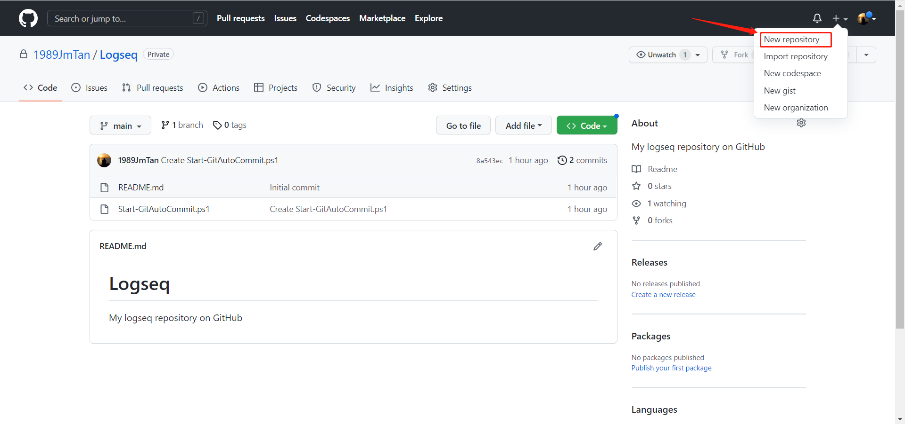
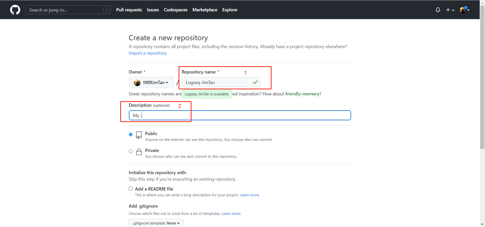

- 基础操作
- 插件安装
- GitHub 同步策略
	- 登录GitHub,创建自己的Logseq仓库
		- 点击[New repository]
			- {:height 271, :width 560}
		- 在[**Repository name**]输入仓库名称，[**Description**]输入描述，选择pubic或 private
			- 
		- 获取到Logseq的仓库地址：  https://github.com/1989JmTan/Logseq
			-
	- 下载本地GitHub,与Logseq仓库链接
		- 本地安装GitHub
		- 编写同步脚本
		- 进行同步调试
	- 进行数据同步
-
-