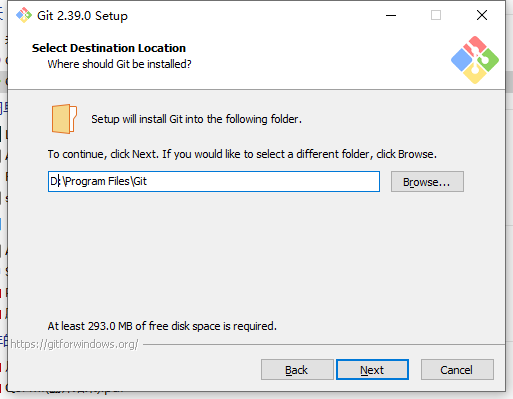

- 基础操作
- 插件安装
- GitHub 同步策略
	- 登录GitHub,创建自己的Logseq仓库
		- 点击[New repository]
		  collapsed:: true
			- {:height 271, :width 560}
		- 在[**Repository name**]输入仓库名称，[**Description**]输入描述，选择pubic或 private
		  collapsed:: true
			- 
		- 获取到Logseq的仓库地址：  https://github.com/1989JmTan/Logseq
		  collapsed:: true
			- ```
			  ssh: connect to host github.com port 22: Connection timed out
			  fatal: Could not read from remote repository.
			  
			  Please make sure you have the correct access rights
			  and the repository exists.
			  ```
	- 下载本地Git
		- Git下载地址:  https://git-scm.com/download/win
		- 安装Git
			- 
			- 
			-
			-
			-
		- 进行同步调试
	- 进行数据同步
-
-